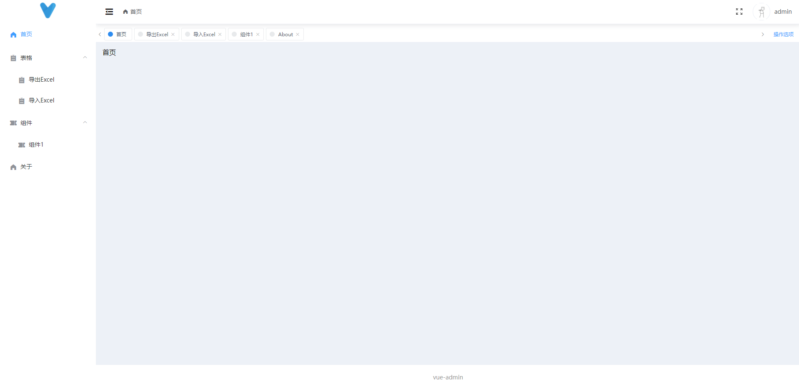

# vue 

## Project setup
```
yarn install
```

### Compiles and hot-reloads for development
```
yarn serve
```

### Compiles and minifies for production
```
yarn build
```

### Lints and fixes files
```
yarn lint
```

### 开启koa开发模式 

[分支](https://github.com/hz199/vue3.0-admin-typescript/tree/feature/serverless)

### 预览
新的预览文件



### vue3.0

这里是vue3.0

首先的是所有的vue文件都引入

import { defineComponent } from 'vue'

用法： 

setup 函数方法就是替代了之前的 created() 组件创建之前的生命周期函数


export default defineComponent({
    新增了setup 的函数方法
    setup() {

    }
})

组件引入的方法  ：
slot 这里是相当于占位符的

<router-view v-slot="{ Component }">
    <transition name="fadeTran" appear>
        <!-- 这里是3的语法 -->
        这里Component 就是指的页面引入的所有文件
        <component :is="Component" />
    </transition>
</router-view>
